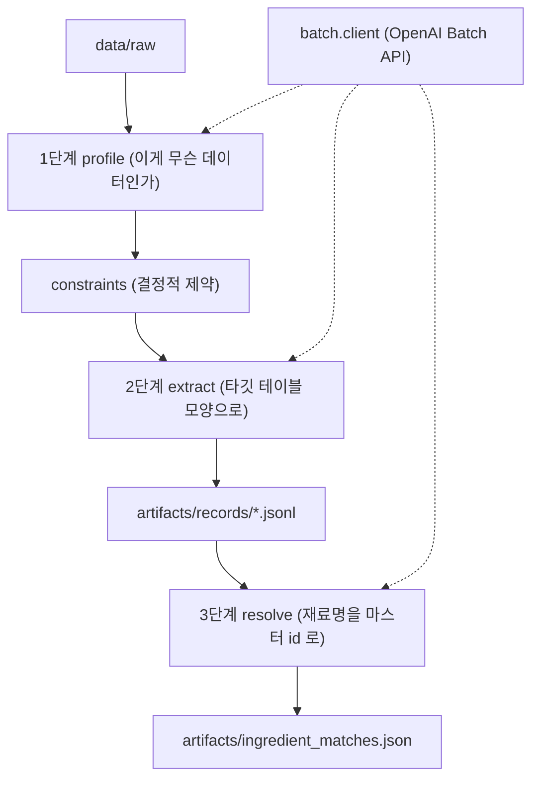
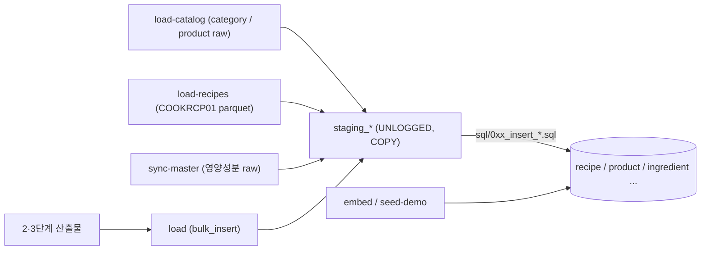
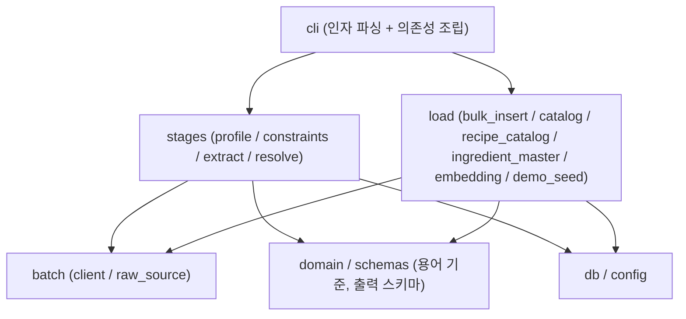
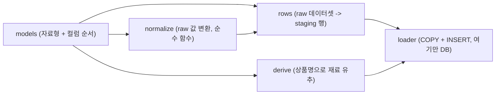

# data_pipeline

raw 데이터를 Neon 에 넣는 폴더입니다. 경로가 둘입니다. 컬럼 의미를 **판단해야 하는**
데이터(레시피, 보관기준)는 LLM 3단계를 거치고, 이미 타깃 모양으로 정리된 데이터
(상품 카탈로그, COOKRCP01 레시피, 영양성분 마스터)는 LLM 없이 바로 적재합니다.

## 1. LLM 3단계 (판단은 LLM 이, 불변식은 코드가)



- 세 단계 모두 **요청 JSONL 쓰기 -> 제출 -> 폴링 -> 수거** 를 `batch.client.BatchRunner` 하나로 돌립니다.
  단계마다 다른 것은 프롬프트와 출력 스키마(`schemas.py`)뿐입니다.
- 1단계는 파일당 1콜입니다. 파이썬에 컬럼명을 적어 두지 않고 LLM 이 컬럼 의미를 판단합니다.
- **`constraints` 가 LLM 뒤에 서는 이유**: 판단은 잘하는데 "겹치면 하나만", "A 를 고르면 B 도"
  같은 제약 준수는 반복해서 실패했습니다. 검증 가능한 불변식만 코드로 내렸습니다.
- 3단계는 **정확 일치 -> 클러스터 전파 -> 남은 대표만 LLM** 순서입니다. 공짜인 것을 먼저 씁니다.
  확신도가 `MATCH_MIN_CONFIDENCE`(0.6) 미만이거나 후보에 없는 id 면 미매칭으로 남깁니다.
- `ingredient_matches.json` 은 gitignore 대상인데 재료 매칭률의 16.4%p 를 혼자 들고 있습니다.

## 2. 적재 경로 (staging 을 거쳐 한 트랜잭션으로)



- 적재는 전부 **asyncpg COPY 로 staging 에 밀어넣고 `sql/` 의 INSERT ... SELECT 로 본 표에 반영**합니다.
  네트워크 왕복이 한 번이고, 전체가 한 트랜잭션이라 중간에 실패하면 아무것도 남지 않습니다.
- 세 적재 명령(`load-catalog`, `load-recipes`, `sync-master`)은 **필수 컬럼이 다 있는 데이터셋만** 고릅니다.
  컬럼명이 자유로운 3단계와 달리 여기는 컬럼명이 계약입니다.
- `staging_*` 컬럼 순서는 파이썬의 `STAGING_*` / `*_COLUMNS` 상수와 같아야 합니다.
  COPY 는 이름이 아니라 순서로 넣어서, 어긋나도 에러 없이 옆 칸에 들어갑니다.
- `embed` 는 `recipe / product / ingredient` 의 `embedding` 컬럼을 채웁니다. 임베딩에 쓴 텍스트는
  `rag_lab` 검색 본문과 같아야 합니다. `seed-demo` 는 데모 사용자·냉장고·재고를 만듭니다.

## 3. 패키지 계층



- **`cli` 는 명령 본체를 갖지 않습니다.** 인자를 읽고 도메인 모듈의 `run_*` 을 부르고 종료코드를 돌려줍니다.
- **`load` 는 `stages` 를 import 하지 않습니다.** `load-catalog` / `load-recipes` 가 재료 마스터 조회를
  필요로 하지만 그 조회는 3단계에 있어서, `cli` 가 함수(`load_lookup`)로 넣어 줍니다.
  데이터셋이 없으면 DB 에 붙기 전에 빠져나가야 해서 호출을 늦춥니다.
- `domain.py` 는 LLM 프롬프트에 들어가는 용어 기준과 정규화 함수(`ingredient_match_key` 등)입니다.
  staging 두 표가 이 키로 조인하므로 한쪽만 바뀌면 조인이 통째로 어긋납니다.

## 4. 분할한 패키지의 공통 구조

`resolve`, `recipe_catalog`, `bulk_insert`, `catalog` 는 한 파일 450~570줄이던 것을 책임별로 나눈
패키지입니다. 네 곳 다 같은 모양이라 `catalog` 하나만 그립니다.



| 패키지 | 아무것도 모르는 조각 | DB 를 아는 조각 | 특이한 조각 |
| --- | --- | --- | --- |
| `stages/resolve` | `models` | `matching`(조회), `run` | `requests`(프롬프트) / `collect`(응답) |
| `load/recipe_catalog` | `parsing`(재료 문자열) | `loader` | - |
| `load/bulk_insert` | `models` | `loader` | `staging`(변환) |
| `load/catalog` | `models` | `loader` | `derive`(유추 = 틀릴 수 있는 로직) |

- 화살표가 **왼쪽에서 오른쪽으로만** 갑니다. `models` 는 프로젝트 안의 무엇도 import 하지 않습니다.
- `__init__.py` 가 기존 이름을 전부 다시 내보내서 바깥의 import 경로는 분할 전과 같습니다.
- `derive` 를 따로 둔 이유는 크기가 아니라 성격입니다. 나머지는 raw 에 있는 것을 옮기지만
  `derive` 는 없는 것을 추측합니다. 틀릴 수 있어서 따로 재고 따로 테스트합니다.

## 명령 한눈에

```
uv run data-pipeline inspect                       # raw 확인 (DB/API 없이)
uv run data-pipeline profile|extract|resolve --job x
uv run data-pipeline submit|collect --stage <단계> --job x
uv run data-pipeline load                          # 2·3단계 산출물 적재
uv run data-pipeline load-catalog|load-recipes|sync-master --apply
uv run data-pipeline embed --target all --apply
uv run data-pipeline seed-demo --users 20 --apply
```
