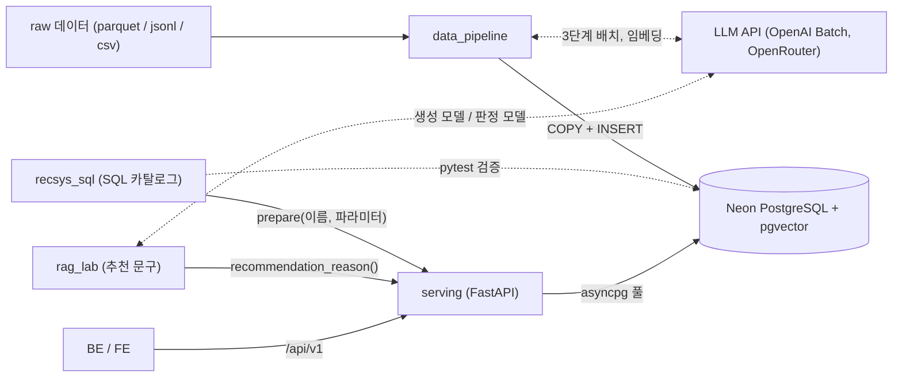
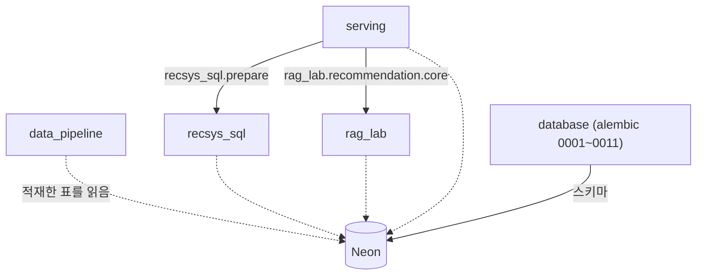
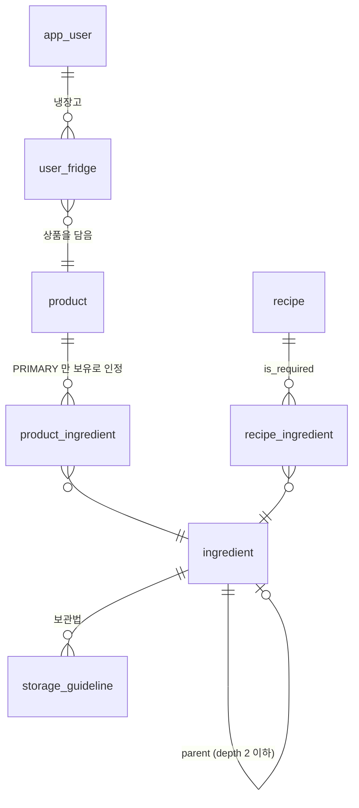

# 전체 구조

신선식품 쇼핑몰의 검색·레시피 추천·마이 레시피를 담당하는 AI 파트입니다.
`uv` 워크스페이스 멤버 4개가 raw 데이터 적재부터 API 서빙까지를 나눠 맡습니다.

## 1. 시스템 전체

- **`data_pipeline`** 은 쓰기 전용입니다. raw 를 읽어 LLM 으로 구조화하고 Neon 에 적재합니다.
- **`recsys_sql`** 은 SQL 의 단일 출처입니다. 검증하는 곳이면서 서빙이 실제로 가져다 쓰는 곳입니다.
- **`rag_lab`** 은 열린 질문 챗봇이 아니라 **추천 문구 생성 전용**입니다.
- **`serving`** 은 `.sql` 파일을 갖지 않습니다. 위 두 폴더의 진입점 둘만 부릅니다.

## 2. 폴더 사이의 의존 방향

- 화살표가 **아래로만** 갑니다. `recsys_sql` 과 `rag_lab` 은 서로도, `serving` 도 모릅니다.
- `data_pipeline` 은 다른 세 폴더가 import 하지 않습니다. 적재가 끝나면 표만 남깁니다.
- 폴더마다 `.env` 와 `config.py` 를 따로 둡니다. 루트 `.env` 는 없습니다.
- `db.py`(Neon DSN 정규화, pooler 감지) 는 네 폴더에 복제되어 있습니다. 의도적이지만
  세 곳 이상에서 갈리기 시작하면 워크스페이스 멤버로 분리하기로 했습니다.

## 3. 핵심 데이터 모델

추천의 뼈대가 되는 표만 남겼습니다. 전체 스키마는 `database/migrations/` 에 있습니다.

- **냉장고는 재료가 아니라 상품을 담습니다.** 재료는 `product_ingredient(role='PRIMARY')` 로 풉니다.
- `ingredient.is_pantry` 가 참이면 냉장고에 없어도 보유한 것으로 칩니다(소금·간장 등).
- `recipe_ingredient.is_required` 가 거짓인 선택 재료는 커버리지 계산에 넣지 않습니다.
- `recipe`, `product`, `ingredient` 는 각각 `embedding VECTOR(1536)` 을 갖습니다(NULL 0행).
- 브랜드는 별도 표 없이 `product.brand_name` 문자열입니다. 재고(`stock_quantity`)는
  파이프라인에서 유일하게 지어내는 값입니다(`seed-demo`).

## 결정된 것 (다시 논의하지 않습니다)

| 결정 | 내용 |
| --- | --- |
| RAG 용도 | 추천 문구 생성 전용. 보관법은 RAG 가 아니라 DB 조회 |
| SQL 단일 출처 | `recsys_sql/src/recsys_sql/queries/` 패키지 **안**. 밖에 두면 휠에 안 담김 |
| 열거값 | 한국어로 저장 (`냉장/냉동/상온`, `끓이기/굽기/...`) |
| LLM 공급자 | `rag_lab` 은 `.env` 로 교체. `data_pipeline` 은 OpenAI Batch 고정 |
| 영문 레시피 | 이미 적재된 1,004건은 두고, 앞으로는 한국어 raw 만 |
