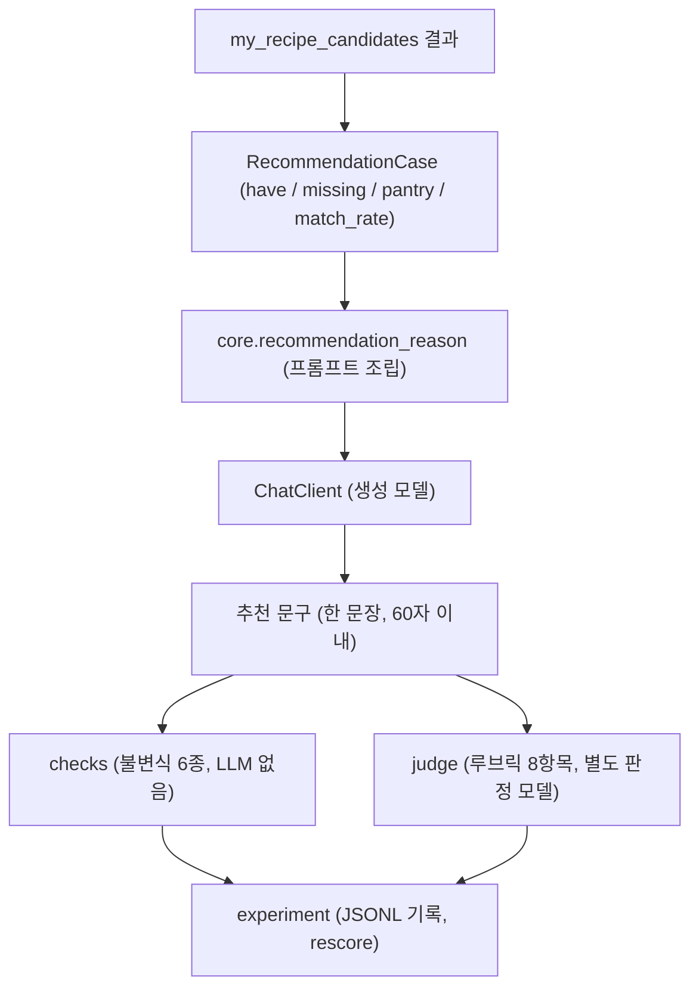
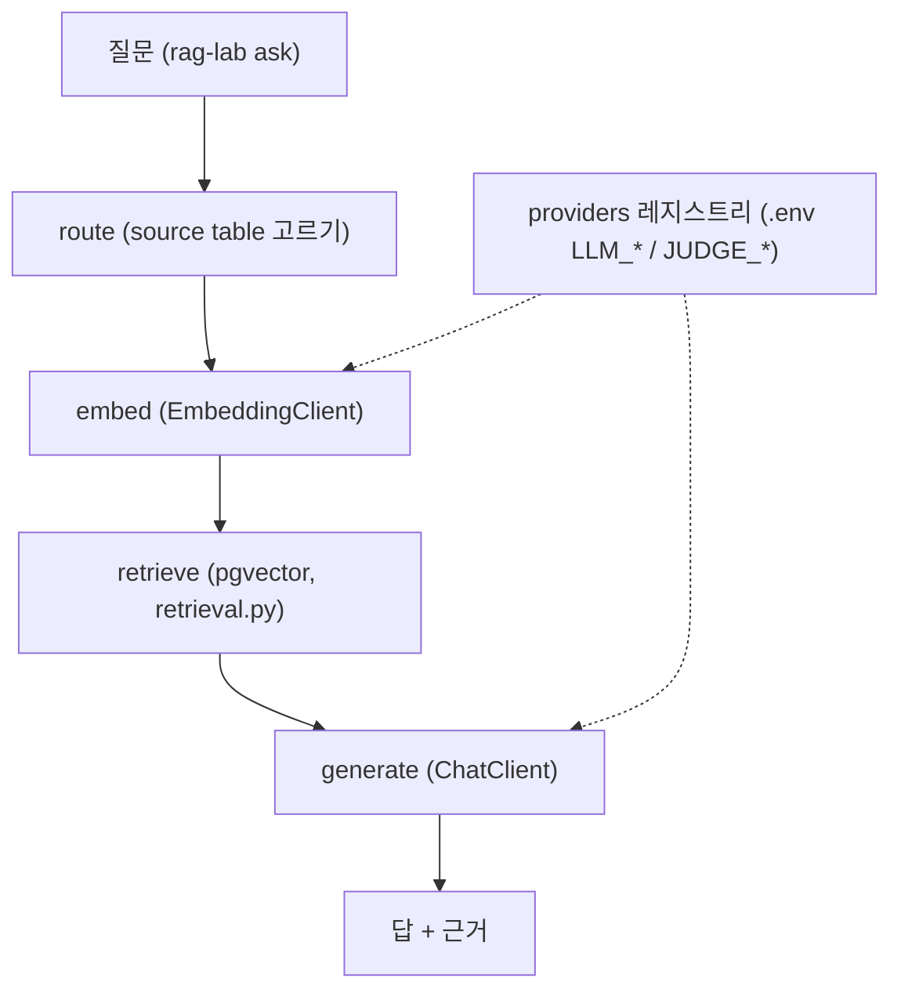

# rag_lab

열린 질문 챗봇이 아닙니다. **추천 문구 한 줄을 만드는 곳**입니다. 실험 도구
(`ask` 검색 그래프, 판정자 교차 검증)가 같이 있지만 서빙이 부르는 것은 하나뿐입니다.

## 1. 추천 문구 경로 (서빙이 쓰는 것)



- **이 경로는 검색을 쓰지 않습니다.** 입력이 이미 구조화된 값(레시피명, `match_rate`, 보유/부족)이라
  벡터 검색을 한 번 더 도는 것은 지연과 비용만 늘립니다. DB 도 열지 않습니다.
- **서빙이 부르는 것은 `core` 뿐입니다.** `checks / judge / experiment` 는 실험용입니다.
  `recommendation_reason(case, chat=...)` 은 클라이언트를 밖에서 받아서, 테스트는 가짜를 넣습니다.
- 품질 검증은 2단입니다. **판단은 LLM 이, 불변식은 코드가.**
  - `checks`: 환각 재료 / 보유 뒤집힘 / 상비재료 구매유도 / 조리시간 지어냄 / 길이 / 빈 문구. 정규식 기반이라
    한국어 동음이의어(`파`/`양파`, `배`/`배가시키다`, `가지`/`네 가지`) 예외가 테스트로 고정되어 있습니다.
  - `judge`: `사람이 쓴 문서/rag 평가 지표 종류.md` 7절의 8항목을 0~10점으로. 평균 7.5 이상 통과.
- **판정 모델은 생성 모델과 달라야 합니다.** 같으면 조립 시점(`require_judge_model`)에 거부합니다.
  자기 평가는 점수를 못 믿게 만듭니다.
- 판정 점수는 절대 기준이 아닙니다. 같은 문구에 판정자마다 1.0점 차가 났고, 항목 순위만 일치했습니다.
  같은 판정자로 잰 실험끼리만 비교합니다.

## 2. 검색 그래프와 LLM 공급자



- LangGraph 로 `route -> embed -> retrieve -> generate` 를 잇습니다. **근거가 0건이면 LLM 을 부르지 않습니다.**
- SQL 은 `retrieval.py` 와 `db.py` 에만 있습니다. `graph.py` 는 `RetrievedDoc` 만 봅니다.
  벡터 DB 를 바꿔도 그래프는 그대로입니다.
- **채팅과 임베딩은 서로 다른 공급자에 붙을 수 있습니다.** OpenRouter 와 Anthropic 은 임베딩이
  없어서, 채팅만 거기서 받고 임베딩은 OpenAI 로 보내는 조합이 흔합니다. `EmbeddingClient` 는
  임베딩이 없는 공급자를 조립 시점에 거부합니다.
- 클라이언트는 `Protocol` 입니다(`ChatClient`, `EmbeddingClient`). OpenAI 호환 API 면
  `base_url` 만 바꿔 같은 SDK 로 붙습니다. `model_id` 를 결과에 남겨 **실제로 무엇이 돌았는지** 기록합니다.
- 임베딩 차원은 응답으로 확인합니다. `VECTOR(1536)` 과 다르면 INSERT 에서 멀리 터지기 전에 여기서 막습니다.

## 파일 배치

```
rag_lab/
├── src/rag_lab/
│   ├── recommendation/   core (서빙용) / checks / judge / experiment
│   ├── graph.py          LangGraph 검색 그래프
│   ├── retrieval.py      pgvector 검색 SQL
│   ├── clients.py        ChatClient / EmbeddingClient / LlmJudgeClient
│   ├── providers.py      공급자 레지스트리
│   └── experiment.py     ask 실험 기록
└── experiments/<github_id>/   상황 25건 + 결과 JSONL (팀원끼리 안 겹치게)
```
