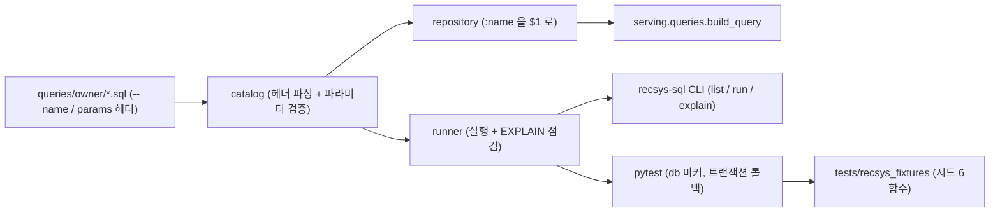
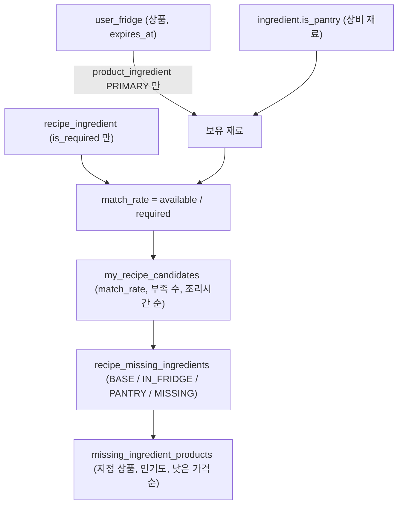
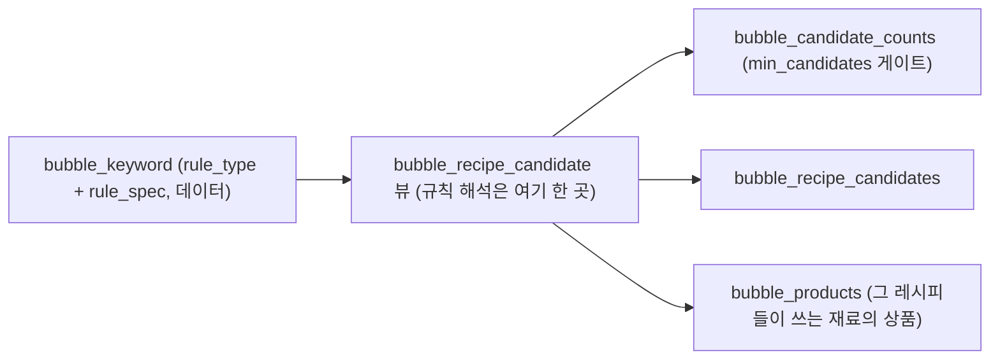

# recsys_sql

추천 SQL 의 **단일 출처**입니다. 여기서 검증하고, 서빙이 여기서 가져다 씁니다.
복사본(`serving/sql/`)은 반드시 갈라져서 없앴습니다.

## 1. 카탈로그 구조



- `.sql` 파일 하나가 쿼리 하나입니다. 맨 위 주석이 계약입니다.
  ```sql
  -- name: my_recipe_candidates
  -- params: user_id:int, min_match_rate:float, max_results:int
  ```
- **`catalog` 가 막는 것**: 이름 중복, 선언 안 한 바인딩, 쓰기 문장, 빠지거나 타입이 틀린 파라미터.
  전부 DB 에 가기 전에 걸립니다.
- **`repository` 는 SQLAlchemy 를 끌어오지 않습니다.** 서빙은 asyncpg 만 쓰기로 한 폴더라
  검증 하나 때문에 ORM 전체가 이미지에 들어가면 안 됩니다. `:name` 을 `$1` 로 바꾸는 것도 여기서 합니다.
- `runner` 는 실행계획을 보고 `product / recipe / recipe_ingredient` 에 순차 스캔이 걸리면 실패시킵니다.
- 카탈로그는 **패키지 안**(`src/recsys_sql/queries/`)에 있어야 합니다. 밖에 두면 휠에 안 담겨
  이미지 첫 요청에서 죽습니다. 개발 중에는 editable 설치라 드러나지 않습니다.

## 2. 보유 판정에서 상품 추천까지

마이냉장고 계열 쿼리 셋이 공유하는 비즈니스 규칙입니다.



- **유통기한이 지난 상품의 재료는 보유가 아닙니다.** (`expires_at IS NULL OR expires_at >= NOW()`)
- **상비 재료는 냉장고에 없어도 보유입니다.** 부족 재료로 보고하지도, 사라고 하지도 않습니다.
- **선택 재료는 커버리지에 넣지 않습니다.** `required_count` 는 `is_required` 만 셉니다.
- 냉장고 재료를 하나도 쓰지 않는 레시피는 후보에 들어오지 않고, `min_match_rate` 미만은 뺍니다.
- 부족 재료는 어디서 충족됐는지로 나뉩니다. 우선순위는 `BASE`(지금 고른 상품) ->
  `IN_FRIDGE` -> `PANTRY` -> `MISSING` 입니다.
- 부족 재료를 채울 상품에서 **품절·비활성은 뺍니다.** 재고는 `stock_quantity IS NULL OR > 0` 입니다.

## 3. 버블 (홈 화면)



- 버블은 코드가 아니라 **데이터**입니다. 라벨과 규칙을 배포 없이 바꿉니다.
- 규칙 해석이 뷰 한 곳에만 있어서 레시피 목록과 상품 목록이 갈라지지 않습니다.
  뷰가 해석하는 `rule_type` 은 `ingredient_count / step_count / ingredient_category / cook_time / servings` 입니다.
- **후보가 `min_candidates` 에 못 미치는 버블은 화면에 내지 않습니다.** 빈 버블을 누르게 하지 않으려는 것입니다.
- 상비 재료 상품이 버블 상품 목록을 채우지 않습니다.

## 쿼리 13종

| 화면 | 쿼리 |
| --- | --- |
| 홈 버블 | `bubble_candidate_counts`, `bubble_recipe_candidates`, `bubble_products` |
| 상품 | `product_detail`, `product_recipes`, `product_storage_guideline` |
| 레시피 | `recipe_detail`, `recipe_missing_ingredients`, `missing_ingredient_products` |
| 마이냉장고 | `my_fridge_items`, `my_recipe_candidates`, `reorder_candidates` |
| 템플릿 | `fridge_recipe_match` (판정 규칙은 `my_recipe_candidates` 와 같고 응답 모양만 다름) |
