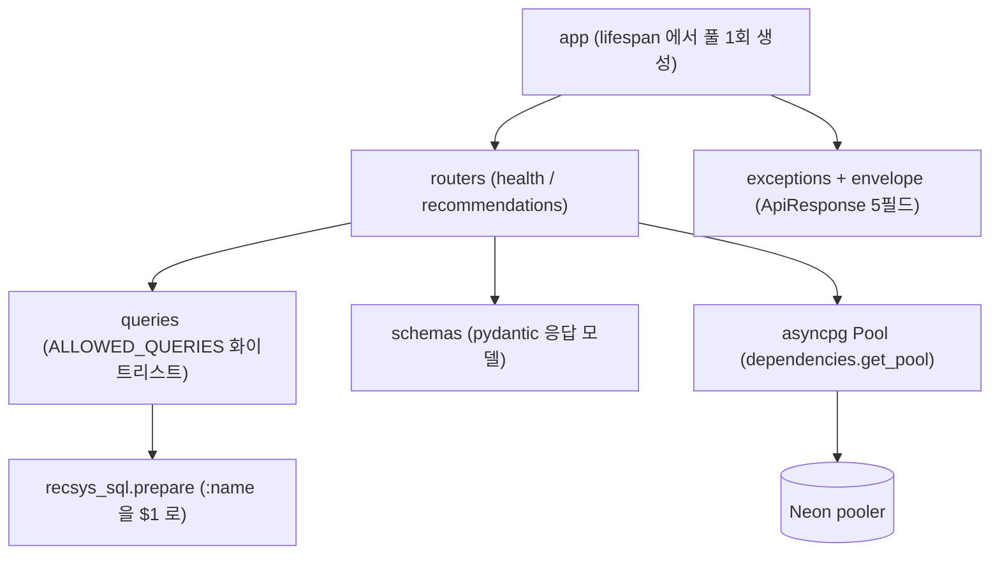
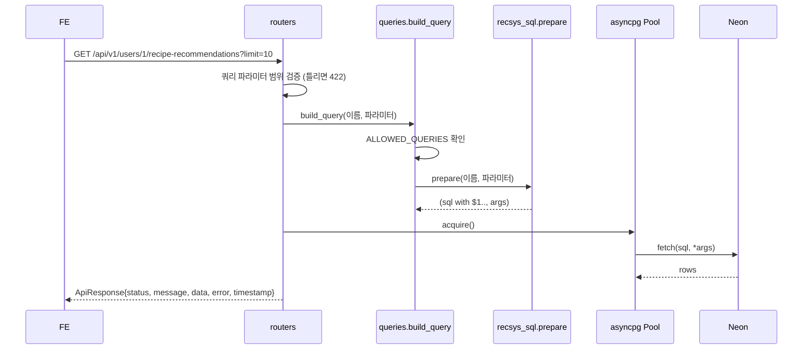

# serving

FastAPI + asyncpg 서빙 서버입니다. **`.sql` 파일을 갖지 않고** `recsys_sql` 카탈로그를 import 합니다.
SQLAlchemy 도 쓰지 않습니다. 정해진 SQL 만 돌리는 경로에 ORM 매핑 비용을 들일 이유가 없습니다.

## 1. 모듈 의존

- **커넥션 풀은 앱이 뜰 때 한 번** 만들어 `app.state` 에 붙입니다. 요청마다 붙으면 Neon 한도를 금방 넘습니다.
  pooler 주소(`-pooler`)면 statement 캐시를 끕니다(PgBouncer transaction 모드).
- **DB 가 없어도 앱은 뜹니다.** DB 가 필요한 엔드포인트만 503 으로 답합니다. 라우팅과 스키마를
  DB 없이 확인하기 위한 것입니다.
- `queries.build_query` 가 하는 일은 둘입니다. 화이트리스트 확인, 그리고 `recsys_sql.prepare` 호출.
  파라미터가 빠지거나 타입이 틀리면 DB 에 가기 전에 걸립니다.
- 헬스체크는 envelope 밖입니다. `/health`(liveness, DB 안 봄) 와 `/health/db`(readiness) 로 나눠서
  DB 가 잠깐 흔들려도 컨테이너가 재시작되지 않게 합니다.
- `.sql` 파일이 이 폴더에 생기면 `tests/test_app.py` 가 실패합니다.

## 2. 요청 한 번

- **모든 응답은 다섯 필드를 항상 담습니다.** 백엔드 Spring `ApiResponse` 와 같은 계약이라
  FE 가 파서 하나로 양쪽 API 를 처리합니다. `data` 가 없어도 `null` 로 자리를 지킵니다.
- `timestamp` 는 `yyyy-MM-dd'T'HH:mm:ss'Z'` UTC 고정입니다.
- 실패 응답의 `error` 는 에러 코드 이름(`INVALID_INPUT_VALUE`, `RESOURCE_NOT_FOUND`, ...)이고
  코드마다 HTTP 상태가 정해져 있습니다. 검증 실패와 없는 경로도 같은 envelope 으로 답합니다.
- 값은 전부 asyncpg 위치 파라미터로 넘어갑니다. SQL 문자열에 값을 끼워 넣지 않습니다.

## 보안

- 로그와 헬스 응답에 DSN·호스트·자격증명을 남기지 않습니다(`mask_dsn`).
- `ENVIRONMENT` 가 `prod` 일 때만 `/docs` 와 `/openapi.json` 을 닫습니다. `local`·`dev` 는 FE 연동 확인용으로 엽니다.
- `.dockerignore` 가 `.env`·키·가상환경·데이터를 빌드 컨텍스트에서 뺍니다(`tests/test_build_context.py`).

## 지금 상태

| 있음 | 없음 |
| --- | --- |
| `/health`, `/health/db` (`reason_llm` 켜짐 여부 포함) | 5xx 비율 알림(PrometheusRule), 에러 추적 도구 |
| `/metrics` (Prometheus, 경로 템플릿별 요청 수·지연) | |
| 읽기 8개: HOME-01, RECO-01/02, PROD-01~03, RECIPE-01/03 | 냉장고 밖 상품 응답의 `image_url` (PROD-01, RECIPE-03 등) |
| My냉장고 4개: 목록·추가·수정·삭제 (FRIDGE-01~04) | 여러 파드가 공유하는 rate limit (지금은 프로세스 메모리) |
| 추천 이유 LLM (앞 3장, `rag_lab.reason_service`, 꺼지면 스스로 다시 켬) | |
| envelope, 풀, 화이트리스트, rate limit, 요청 id·JSON 액세스 로그 | |
| `Dockerfile`, `.dockerignore`, ECR 배포 워크플로(#41) | |

엔드포인트와 응답 계약의 정본은 `docs/api/api-v1.md` 이고, 배포와 환경변수는 `docs/deploy/deployment-eks.md` 입니다.
